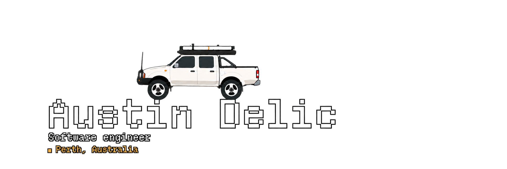
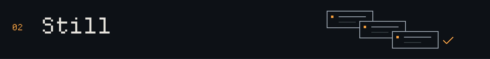

<a href="https://austindelic.com"></a>

I'm Austin, a software engineer in Perth and Founding Engineer at **The Next Something**.

I build web applications, Rust tools, and graphics you can explore in a browser or terminal.

[Portfolio ↗](https://austindelic.com) · [Email](mailto:austin@austindelic.com) · [LinkedIn ↗](https://www.linkedin.com/in/austindelic)

## Selected work

### Blackhole

An interactive black-hole renderer for the web and Rust, with a React component, Ratatui widget, standalone explorers, and Ghostty shader.

[Explore ↗](https://blackhole.austindelic.com) · [Source and installation ↗](https://github.com/austindelic/blackhole)

<h3><a href="https://austindelic.com"></a></h3>

A website and a native terminal app, built around an interactive ASCII black hole. Shared content and shaders connect the two.

**Astro · React · Rust · Ratatui · wgpu**

[Explore the website ↗](https://austindelic.com) · [How the site and terminal fit together ↗](https://austindelic.com/blog/site-and-terminal/) · [Portfolio source](https://github.com/austindelic/portfolio) · [Terminal source](https://github.com/austindelic/portfolio/tree/main/apps/tui) · [Blackhole renderer](https://github.com/austindelic/blackhole)

<h3><a href="https://github.com/austindelic/still"></a></h3>

A project environment manager that makes setup explicit: typed configuration, installation plans, lockfiles, and trust checks when your config changes.

**Rust · CLI + TUI · TOML**

[View source ↗](https://github.com/austindelic/still)

<h3></h3>

Turns visual learning material into tactile SVG graphics and guided audio for blind and low-vision users. Started at Perth Hackerhouse.

**Next.js · Go · SVG · Audio**

##  Run the portfolio

Explore the black hole from your terminal:

```sh
npx austindelic
```

<details>
<summary>Requirements and controls</summary>

Requires **Node 22+** and a terminal of at least **60 × 18 characters**. Runs on macOS, Linux, and Windows; see the [platform requirements](https://github.com/austindelic/portfolio/tree/main/apps/tui/npm) for supported versions and architectures.

Use **Tab / arrows** to navigate, **Enter** to open, and **?** for help. In Explore, move with **WASD**, **IJKL**, or mouse dragging. **Ctrl-C** quits; **q** also quits outside Explore.

The GPU renderer runs locally and falls back to static artwork if graphics initialization fails. Portfolio content is embedded and works offline after installation; external links need a connection.

</details>


---

[Austin Develops ↗](https://youtube.com/@austindevelops)

<details>
<summary>On repeat</summary>

[](https://github.com/kittinan/spotify-github-profile)

</details>
