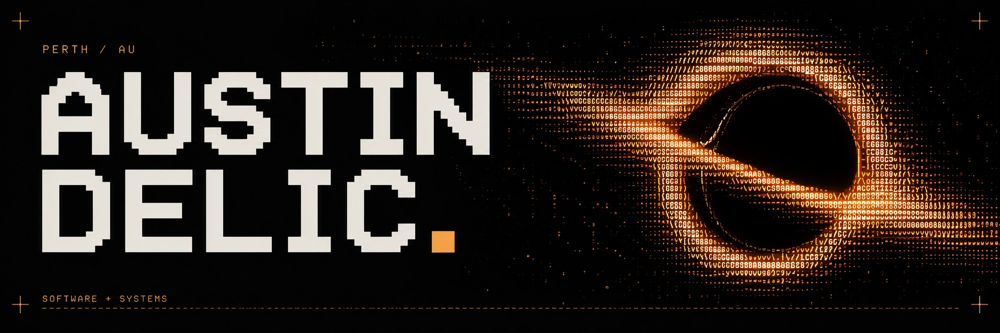
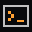
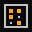

<a href="https://austindelic.com"></a>

Software engineer in Perth. Founding Engineer at **The Next Something**.

I build production applications, Rust tooling, and graphics that run in browsers and terminals.

[Portfolio](https://austindelic.com) · [Email](mailto:austin@austindelic.com) · [LinkedIn](https://www.linkedin.com/in/austindelic) · [Résumé](https://austindelic.com/resume.pdf)

##  Run it

My portfolio also runs as a native Rust app, with a GPU-rendered black hole drawn in terminal characters.

```sh
npx austindelic
```

Node 22+. macOS, Linux, or Windows. Explore with WASD; press `?` for controls and `q` to quit outside Explore. Content is embedded, so the app works offline after installation.

## Selected work

### Blackhole

An interactive black-hole renderer for the web and Rust, with a React component, Ratatui widget, terminal explorer, and Ghostty shader.

[Explore](https://blackhole.austindelic.com) · [Source and installation](https://github.com/austindelic/blackhole)

###  Portfolio

Astro on the web; Rust, Ratatui, and wgpu in the terminal. Shared content and shaders, an explorable black hole, and a static fallback when graphics initialization fails.

[Open the website](https://austindelic.com) · [Source](https://github.com/austindelic/portfolio) · [Terminal source](https://github.com/austindelic/portfolio/tree/main/apps/tui)

###  Still

A Rust project environment manager. Typed configuration, install planning, lockfiles, and SHA-256 configuration trust, with CLI and TUI frontends over a shared async engine.

[Source](https://github.com/austindelic/still) · [Design notes](https://austindelic.com/blog/still-and-desired-state/)

###  Tactify

Visual learning material converted into tactile SVG graphics and guided audio for blind and low-vision users. Built at Perth Hackerhouse with Next.js, Go, and protobuf APIs.

[Build notes](https://austindelic.com/blog/building-tactify/)

---

Previously worked on healthcare payments at Scrypt Ventures with Angular, .NET, and Azure, and owned client applications from requirements through deployment and support.


<details>
<summary>on repeat</summary>

[](https://github.com/kittinan/spotify-github-profile)

</details>

[Austin Develops ↗](https://youtube.com/@austindevelops)
